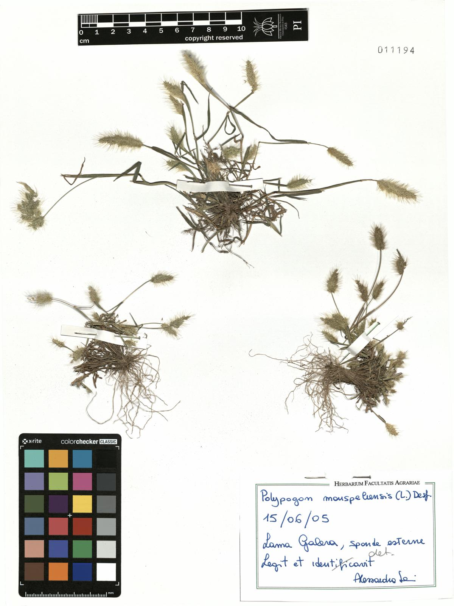
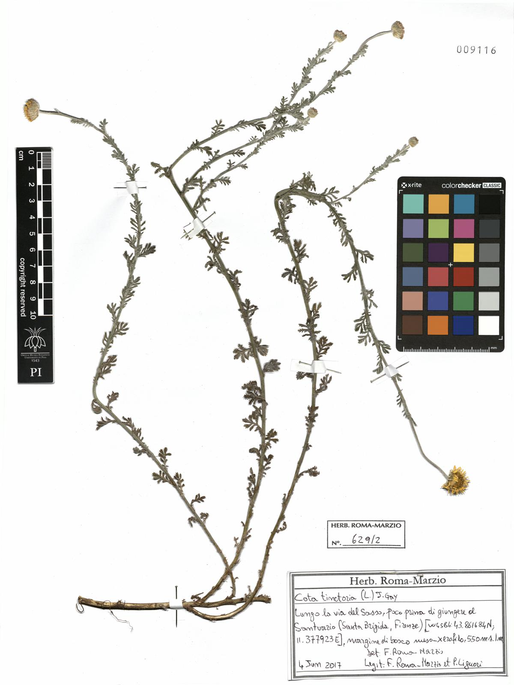
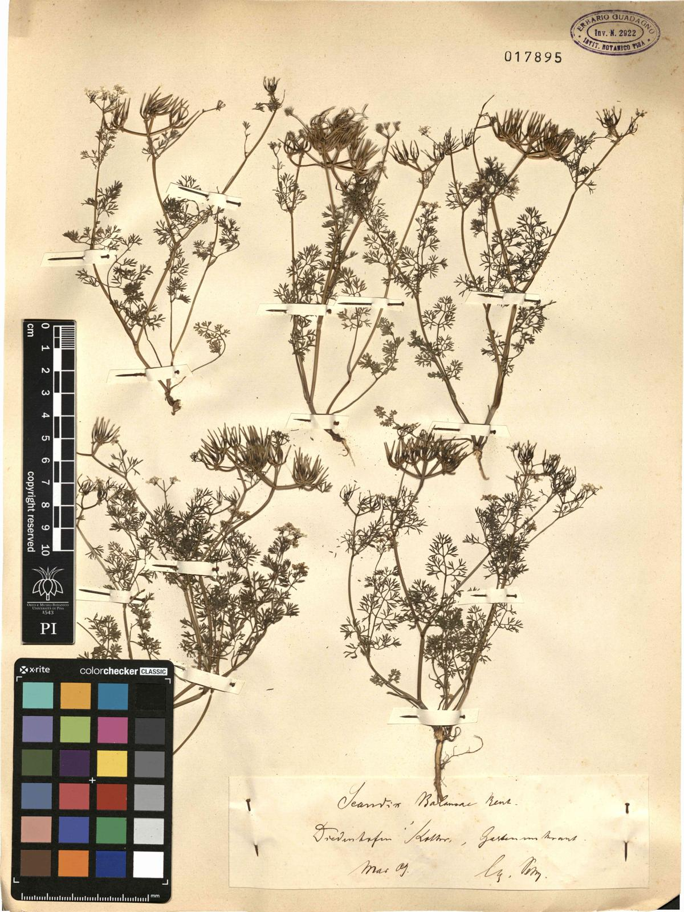
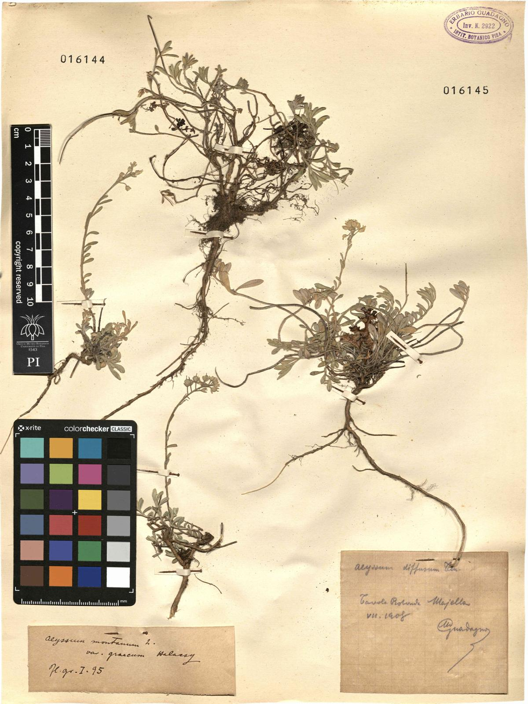
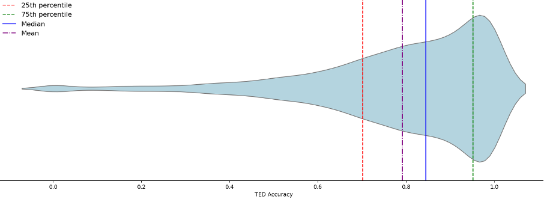

# HeR-T: Herbarium specimen label Recognition Transformer  

## 📃 Paper
Application of computer vision to the automated extraction of metadata from natural history specimen labels: A case study on herbarium specimens **(Under Review)**

## 💁 Authors
Zacchigna, Jacopo; Liu, Weiwei; Pellegrino, Felice Andrea; Peron, Adriano; Roma-Marzio, Francesco; Peruzzi, Lorenzo; Martellos, Stefano

## 🚀 Overview  
HeR-T (Herbarium specimen label Recognition Transformer) is a fine-tuned vision-language model designed for automated metadata extraction of history specimen labels, especially herbarium specimen labels. It leverages Donut-base and has been fine-tuned with 55,089 herbarium specimen images from the Herbarium of the University of Pisa (international acronym PI). 

## 🔥 Features  
- **Fine-tuned on** specimen images from the Herbarium of the University of Pisa for automated metadata extraction of history specimen labels
- **Supports** image inputs with labels containing printed, handwritten, or mixed-format texts  
- **Evaluation**: Tree Edit Distance (TED) accuracy score with the formula max(0, 1−TED(pr, gt)/TED(φ, gt)), where gt, pr, and φ stand for ground truth, prediction, and empty trees respectively 
- **Pre-trained weights** are loaded from Donut-base on Hugging Face(naver-clova-ix/donut-base)

## 🏗️ Installation  
```bash
conda create -n HeR-T python=3.9
conda activate HeR-T
git clone https://github.com/elderprince/HeR-T-Fine-tuning.git
cd HeR-T-Fine-tuning
pip install -r requirements.txt
```

## 💻 Usage  
### Inference  
```bash
python scripts/inference.py --config experiments/inference_config.yaml
```

### Fine-tuning  
```bash
python scripts/train.py --config experiments/train_config.yaml
```

## 📂 Model Checkpoints  
Download pre-trained weights from Hugging Face ([elderprince/HeR-T](https://huggingface.co/elderprince/HeR-T)). 

## 📜 Dataset  
Our study was carried out on a dataset of digitized specimens from the Herbarium of the University of Pisa (international acronym PI). The dataset comprises 55,089 specimens, which were digitized and published online using the online database JACQ Virtual Herbaria (http://www.jacq.org/). 

The images are in JPEG format, while the metadata (derived from a manual transcription of the original labels in each specimen) are organized in a spreadsheet, in which each row represents a single specimen. The dataset hosts digital specimens from 97 countries, which were collected in the span of two centuries.

This dataset can also be openly accessed on Global Biodiversity Information Facility (GBIF) ([LINK](https://www.gbif.org/dataset/1e98cc26-065e-40ca-9c57-20fa0a2f4981)).

## 🏆 Results
Below are some examples of the model's predictions on the herbarium specimen labels:

#### Best case sample 1

- **Ground Truth**: 
"Nome_verbatim": "Polypogon monspeliensis (L.) Desf."
"Locality": "Lama Galera, sponde esterne"
"Elevation": ""
"Day": "15"
"Month": "6"
"Year": "2005"
- **Prediction**: 
"Nome_verbatim": "Polypogon monspeliensis (L.) Desf."
"Locality": "Lama Galera, sponde esterne"
"Elevation": ""
"Day": "15"
"Month": "6"
"Year": "2005"
- **TED accuracy score**: 1.0

#### Best case sample 2

- **Ground Truth**: "Nome_verbatim": "Cota tinctoria (L.) J. Gay"
"Locality": "Lungo la via del Sasso, poco prima di giungere al Santuario (Santa Brigida, Firenze), margine di bosco meso-xerofilo"
"Elevation": "550"
"Day": "4"
"Month": "6"
"Year": "2017"
- **Prediction**: 
"Nome_verbatim": "Cota tinctoria (L.) J. Gay"
"Locality": "Lungo la via del Sasso, poco prima di giungere al Santuario (Santa Brigida, Firenze), margine di bosco meso-xerofilo, 550 m s.l.m."
"Elevation": "550"
"Day": "4"
"Month": "6"
"Year": "2017"
- **TED accuracy score**: 0.899

#### Worst case sample 1

- **Ground Truth**: 
"Nome_verbatim": "Scandix balansae Reut. ex Boiss."
"Locality": "Diedenhofen"
"Elevation": ""
"Day": ""
"Month": "5"
"Year": "1909"
- **Prediction**: 
"Nome_verbatim": "Scandix balmosa L. "
"Locality": "Diedendorfen Stett.r., Gestenmark"
"Elevation": ""
"Day": ""
"Month": "5"
"Year": "1909"
- **TED accuracy score**: 0.231
- **Reason**: Complex handwriting texts

#### Worst case sample 2

- **Ground Truth**: 
"Nome_verbatim": "Potentilla speciosa subsp. speciosa Willd."
"Locality": "Tre potenze legit in editis apennini pistoriensis loco dicto Tre Potenze comunicavit Petrus Savi anno 1830."
"Elevation": ""
"Day": ""
"Month": ""
"Year": "1830"
- **Prediction**: 
"Nome_verbatim": "Potentilla speciosa Willd."
"Locality": ""
"Elevation": "" 
"Day": ""
"Month": ""
"Year": "1830"
- **TED accuracy score**: 0.204
- **Reason**: More than one specimen in an image

#### Worst case sample 3

- **Ground Truth**: 
"Nome_verbatim": "Alyssum montanum var. graecum Hal\\u00e1csy"
"Locality": ""
"Elevation": ""
"Day": ""
"Month": ""
"Year": ""
- **Prediction**: 
"Nome_verbatim": "Alyssum diffusum Ten."
"Locality": "Tavola Rotonda Majella"
"Elevation": ""
"Day": ""
"Month": "7"
"Year": "1908"
- **TED accuracy score**: 0
- **Reason**: More than one specimen in an image

### Quantitative Results
The model's performance was evaluated using the Tree Edit Distance (TED) accuracy score. The following table summarizes the results:

| Metric          | Score  |
|-----------------|--------|
| Average testing TED accuracy       | 0.788   |
| Median testing TED accuracy          | 0.851   |

Violin distribution chart of the evaluation on the test set is below: 



## 🤝 Acknowledgments  
The authors are grateful to CINECA for allowing the use of their HPC facilities in the framework of the project IsCb8_HeR-T (2024-2025). 

## 📜 License  
This project is licensed under the GNU General Public License - see the [LICENSE](LICENSE) file for details.  

## 🔗 References  
- Donut 🍩 : Document Understanding Transformer ([LINK](https://github.com/clovaai/donut))
- Donut-base ([HuggingFace](https://huggingface.co/naver-clova-ix/donut-base))
